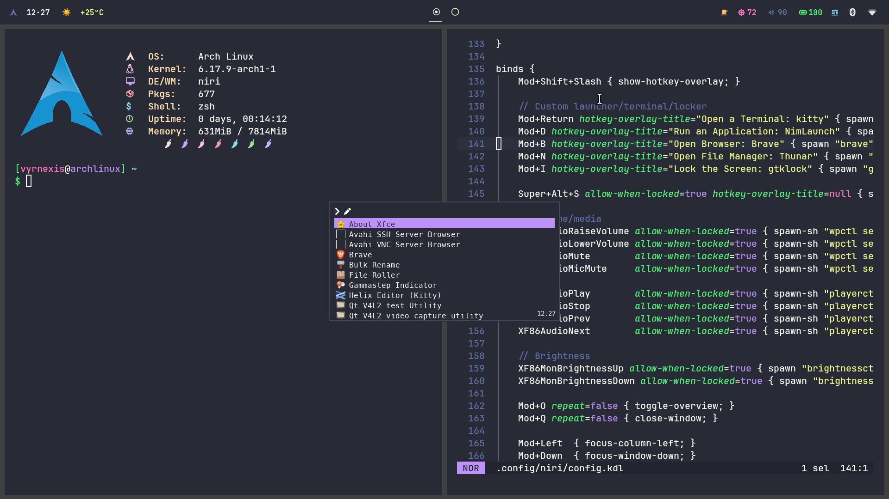

# Niri Install



An opinionated Arch Linux bootstrapper for a complete Niri workstation. It installs the compositor, desktop integration, daily applications, hardware support, Dracula configuration, and a working greetd login flow.

## Requirements

- A current x86-64 Arch Linux installation
- A regular user with `sudo` access
- A working internet connection
- `git` installed long enough to clone this repository
- No partial system upgrade in progress

For a minimal `archinstall` base, select NetworkManager and create an administrator user. PipeWire may be selected there or installed by this script.

## Install

```bash
sudo pacman -S --needed git
git clone https://github.com/Vyrnexis/Niri-install.git
cd Niri-install
./niri_install.sh
```

The installer performs a full `pacman -Syu` before installing packages. It prompts before making changes and leaves package-manager prompts interactive.

Supported options:

```text
-y, --yes              Accept installer and package-manager prompts
    --no-nymph         Skip the optional Nymph system-summary binary
    --no-shell-change  Keep the current login shell
-h, --help             Show installer help
```

The equivalent environment variables are `ASSUME_YES=1`, `INSTALL_NYMPH=0`, and `CHANGE_SHELL=0`.

The bootstrapper runs with the Bash included in the Arch base system. Fish is installed and selected as the user's login shell after configuration is complete.

## Installed Experience

- Niri launched through the packaged `niri-session` wrapper
- greetd with tuigreet, session selection, remembered user, and remembered session
- XWayland compatibility through `xwayland-satellite`
- GNOME and GTK desktop portals for screen sharing and file pickers
- Waybar, Mako notifications, SwayOSD, gtklock, swayidle, and a solid-color wallpaper
- NimLaunch from the `nimlaunch-bin` AUR package, with Fuzzel as a fallback
- NimLaunch integrations for Niri windows, PipeWire outputs, clipboard history, screenshots, Wi-Fi, Bluetooth, calculations, services, and session actions
- Brave from the AUR, with Firefox as an official-repository fallback
- Thunar with archive, removable-media, network-share, phone, camera, and thumbnail support
- PipeWire, WirePlumber, PulseAudio/JACK/ALSA compatibility, media keys, MPD, and MPRIS controls
- NetworkManager, OpenVPN integration, Bluetooth, power profiles, and removable-drive automounting
- Printing, network-printer discovery, scanner support, firmware tools, and CPU microcode detection
- Kitty, Helix, Superfile, Zathura, mpv, imv, terminal utilities, Nerd Fonts, CJK fonts, and emoji fallback
- Fish as the default login shell, with native autosuggestions, completions, FZF, Zoxide, and a Dracula prompt
- Matching Kitty and Helix terminal cheatsheets installed under `~/.local/bin`
- Dracula GTK, icon, cursor, terminal, editor, notification, lock-screen, and Waybar styling

Package manifests are consolidated into [`packages/core.txt`](packages/core.txt), [`packages/extras.txt`](packages/extras.txt), and [`packages/aur.txt`](packages/aur.txt). Comment headers retain the functional grouping inside each manifest. Packages promoted to the official Arch repositories, including `greetd-tuigreet`, `satty`, `gtklock`, and `swayosd`, are installed with pacman rather than paru.

## Configuration Safety

- Existing user configs are preserved unless this repository owns the same path.
- Replaced files are copied to `~/.local/state/niri-install/backups/<timestamp>/`.
- Fish uses the repository-owned `~/.config/fish/config.fish`; an existing file at that path is backed up before replacement.
- Paru uses the repository-owned `~/.config/paru/paru.conf`, installed before the first AUR operation. It skips the interactive PKGBUILD review while retaining package signatures, integrity checks, and unknown PGP-key confirmation.
- The obsolete `~/.config/environment.d/10-dracula.conf` file is retired because forced toolkit backends can break XWayland and toolkit fallback.
- An already enabled display manager is not replaced. Niri remains available through its packaged session entry.

Running the installer again refreshes packages and repository-owned configuration without duplicating generated state.

## Default Keybindings

`Mod` is the Super key.

- `Mod+Return`: Kitty
- `Mod+D`: NimLaunch, or Fuzzel if NimLaunch is unavailable
- `Mod+B`: Brave, or Firefox if Brave is unavailable
- `Mod+N`: Thunar
- `Mod+I`: lock the session
- `Mod+Alt+V`: clipboard history
- `Mod+Shift+Print`: select and annotate a screenshot with Satty
- `Mod+Shift+/`: show Niri's keybinding overlay
- `Mod+Shift+E`: exit the Niri session

The complete binding set is in [`.config/niri/config.kdl`](.config/niri/config.kdl).

## NimLaunch Shortcuts

- `:scripts`: Niri windows, audio outputs, clipboard history, Wi-Fi, and Bluetooth
- `:ss`: area or full-desktop screenshots to a file or the clipboard
- `:sys`: lock, suspend, log out, reboot, or shut down
- `:svc <unit>`: inspect a systemd service and its journal
- `:docs`: Nim, Go, Python, and Free Pascal documentation
- `:cheats`: open the installed Helix or Kitty reference
- `:places`: open common user directories
- `:m <expression>`: calculate a result and copy it to the clipboard

In Helix, `Ctrl+E` opens Superfile as a file chooser. Run `helix-cheatsheet` or `kitty-cheatsheet` in a terminal for the matching key reference.

## After Installation

- Reboot so the display manager, new group membership, microcode, and enabled services start cleanly.
- Select Niri in tuigreet if a different session was remembered.
- Set `WEATHER_LOCATION` before Waybar starts to override the default `Perth` weather location.
- Define an active profile in `~/.config/kanshi/config` if automatic multi-monitor layouts are required.
- Review the timestamped backup directory before removing old configurations.

## Troubleshooting

- `paru` is built from its AUR package after `base-devel` is installed. If no working Cargo toolchain exists, the installer installs Rustup and selects stable; an existing Rust or Rustup toolchain is retained.
- PKGBUILD review is disabled by the installed Paru configuration. Use `paru --review -S <package>` when a manual review is wanted; AUR packages remain user-produced and should only be installed from trusted sources.
- Required packages are validated before each package group is installed; stale package databases are avoided by the initial full upgrade.
- The consolidated AUR manifest is required because it contains the selected themes as well as Brave and NimLaunch; Firefox and Fuzzel remain installed as operational fallbacks.
- PipeWire portal and user services may not start from a bare TTY until the first graphical login; their packaged activation paths remain installed.
- If another display manager is enabled, the installer reports it and does not replace it automatically.
